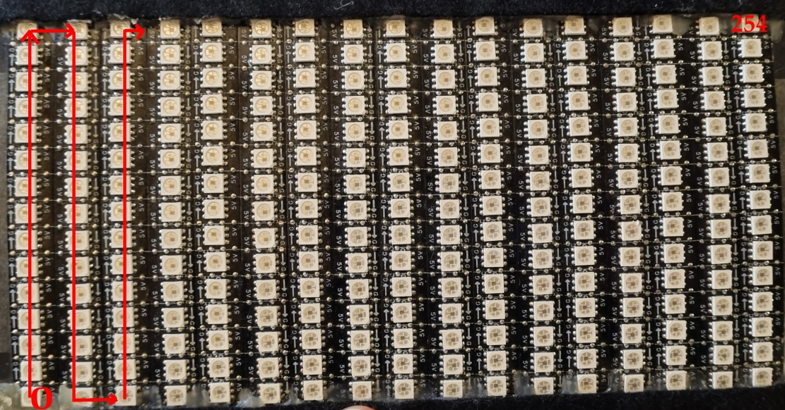

# ESP32_SDC_VPixelPlayer
ESP32 CD Card Animation Player for APA102/SK9822 Pixels 

# Libraries Used

APA102 SPI Driver - https://github.com/leonyuhanov/esp8266apa102driver modified with advaced pixel mapping functions

ESP32 PNG Library - https://github.com/lagunax/ESP32-upng - modified to work with SD card instead of SPIFFS


# Animation Pre requisites

Your animation must be in .png 24BIT colour, no transparency or anythhing else fancy. 
The animation must be sized to be the exact same size as your maped LED matrix.
The animation must start with a "AnimationName_00000.png" frame and you can have up to 99,999 frames per animation.
You can also set a frame delay in the playlist file below if you want to slow down or speed up the playback.

# SDCARD Pre requisites

Format the SDCARD as one FAT32 Volume. Size isnt important. The root of the SDCard needs to have the following structure:

````
[DIR] AnimationOne
[DIR] AnimationTwo
[DIR] AnimationThree
[FILE] playlist
````

Example layout of one of the animation folders:

````
/AnimationOne
AnimationOne_00000.png
AnimationOne_00001.png
AnimationOne_00002.png
AnimationOne_00003.png
AnimationOne_00004.png
AnimationOne_..............
AnimationOne_00100.png
````

The Playlist file is set up as follows:
````
[Case Senstive Animation Name],[Number of Frame Files],[Delay in MILISECONDS between each frame];
[Case Senstive Animation Name],[Number of Frame Files],[Delay in MILISECONDS between each frame];
[Case Senstive Animation Name],[Number of Frame Files],[Delay in MILISECONDS between each frame];
....
````

Example layout of the "playlist" file

````
AnimationOne,100,10;AnimationTwo,200,20;AnimationThree,50,100;
````

# Pixel Map

This code is set up to drive a panel of 255 x APA102 set up on a panel 17 pixels wide and 15 pixels tall. The panel was made with 17 strips of 15 pixels that were laid out verticaly in a SNAKING fashion. Pixel 0 is at the bottom left, this goes UP then right than down then right then up then right etc...



To create the pixel map there is an included (Libre Office) spread sheet "PixelMap.ods" that you can use to make a pixel map for ANY layotu of LEDS. The file generates a 2D C++ array that you can paste directly into the code into the "maskMap" variable. 

"rows" is the Y/height plane and "cols" is the X/width plane

````
//LED MAP
const short int maskMap[rows][cols]= {{14,15,44,45,74,75,104,105,134,135,164,165,194,195,224,225,254},{13,16,43,46,73,76,103,106,133,136,163,166,193,196,223,226,253},{12,17,42,47,72,77,102,107,132,137,162,167,192,197,222,227,252},{11,18,41,48,71,78,101,108,131,138,161,168,191,198,221,228,251},{10,19,40,49,70,79,100,109,130,139,160,169,190,199,220,229,250},{9,20,39,50,69,80,99,110,129,140,159,170,189,200,219,230,249},{8,21,38,51,68,81,98,111,128,141,158,171,188,201,218,231,248},{7,22,37,52,67,82,97,112,127,142,157,172,187,202,217,232,247},{6,23,36,53,66,83,96,113,126,143,156,173,186,203,216,233,246},{5,24,35,54,65,84,95,114,125,144,155,174,185,204,215,234,245},{4,25,34,55,64,85,94,115,124,145,154,175,184,205,214,235,244},{3,26,33,56,63,86,93,116,123,146,153,176,183,206,213,236,243},{2,27,32,57,62,87,92,117,122,147,152,177,182,207,212,237,242},{1,28,31,58,61,88,91,118,121,148,151,178,181,208,211,238,241},{0,29,30,59,60,89,90,119,120,149,150,179,180,209,210,239,240}};
const short int deadValue=-1;

````
Note the presense of the "deadValue" var set to -1. This lets you create maps that dont have pixels in every physical location.


# Boot Up Flow

1.  Insert the SD CARD and power on
2.  The Pre prosessor will RUN over the playlist and compile a .STREAM file for each animation. You will see a new folder for each animation called "AnimationNameSTREAM" and inside it will be teh stream file named "AnimationName.STREAM"
3.  After all animation folders are processed the ESP32 will start playing the streams in the order listed in the file 'playlist'. You can put multiple entries for the same animation. Each animation has 2 options. Number of frames in the animation folder and the delay in MILISECONDS between each frame. 10ms delay is good for very smooth frame rates.

